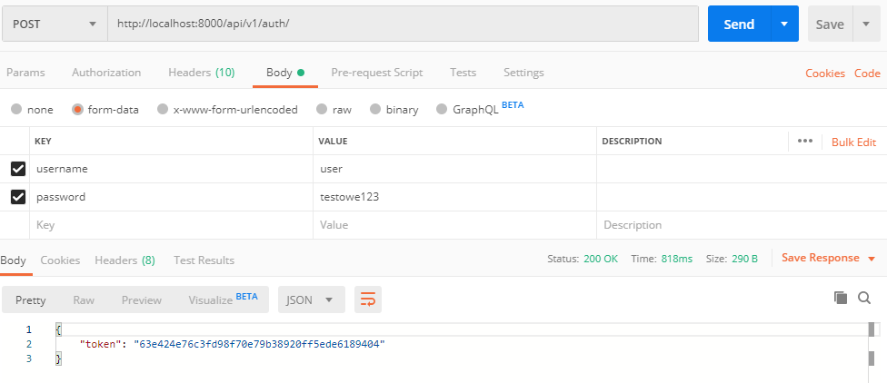

# Movies API
_______________________

# Instalation
To run locally, do the usual: 
1. Create a Python virtualenv 
    `pip install virtualenv` 
    `virtualenv ENV` 
    
2. Activate your ENV: 
    `ENV\Scripts\activate` 
    
3. Install dependencies: 
    `pip install -r requirements.txt` 
    
4. Run Django server: 
    `python manage.py runserver` 
    
Migrate and create super user.  
Admin page - http://localhost:8000/admin 

# Instruction
<b>Create new user</b> 
Go to http://localhost:8000/api/users/ and POST username and password:

<b>Get auth token</b> 
Go to http://localhost:8000/auth/, POST username and password and copy your token:

<b>Add new movie</b> 
Go to http://localhost:8000/api/movies/, POST movie title in BODY and token in HEADERS:

<b>See also</b> 
Reviews - http://localhost:8000/api/reviews/ 
Favorites - http://localhost:8000/api/favorite/ 
